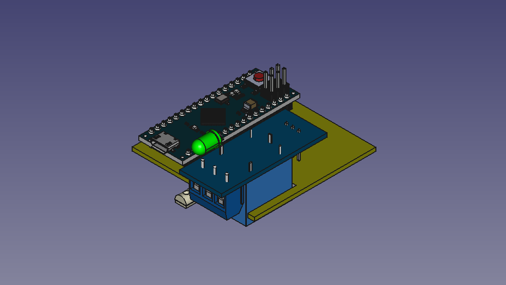
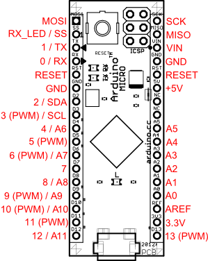
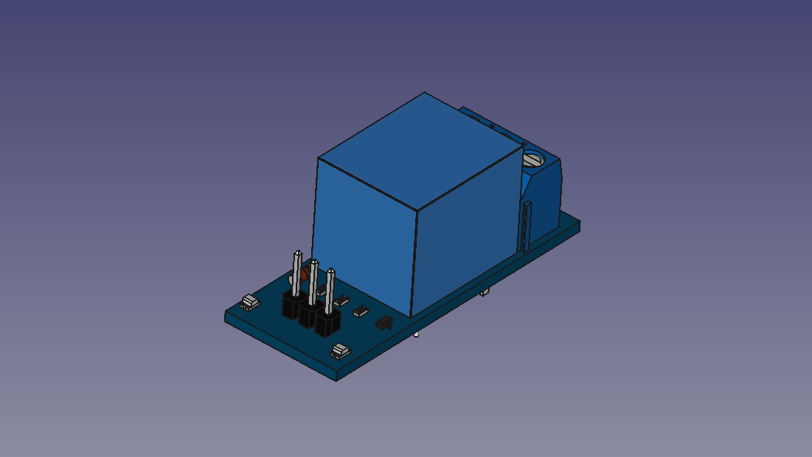

# fC Mark I - Fan Controller

## Electronics

### Arduino
Arduino Micro

#### Pin designation table
 id | pin |   type    | direction |               description
----|-----|-----------|-----------|------------------------------------------
  0 |   0 | digital   | input     | Serial communication
  1 |   1 | digital   | output    | Serial communication
  2 |   0 | -         | -         | -
  3 |   3 | digital   | output    | Relay
  4 |   4 | -         | -         | -
  5 |   5 | -         | -         | -
  6 |   6 | -         | -         | -
  7 |   7 | -         | -         | -
  8 |   8 | -         | -         | -
  9 |   9 | PWM       | output    | Alarm LED
 10 |  10 | -         | -         | -
 11 |  11 | -         | -         | -
 12 |  12 | -         | -         | -
 13 |  13 | PWM       | output    | Status LED
 14 |   0 | analog    | input     | Temperature sensor
 15 |   1 | -         | -         | -
 16 |   2 | -         | -         | -
 17 |   3 | -         | -         | -
 18 |   4 | -         | -         | -
 19 |   5 | -         | -         | -

#### Diagram

#### ATmega 32U4-Arduino Pin Mapping

### Relay module

