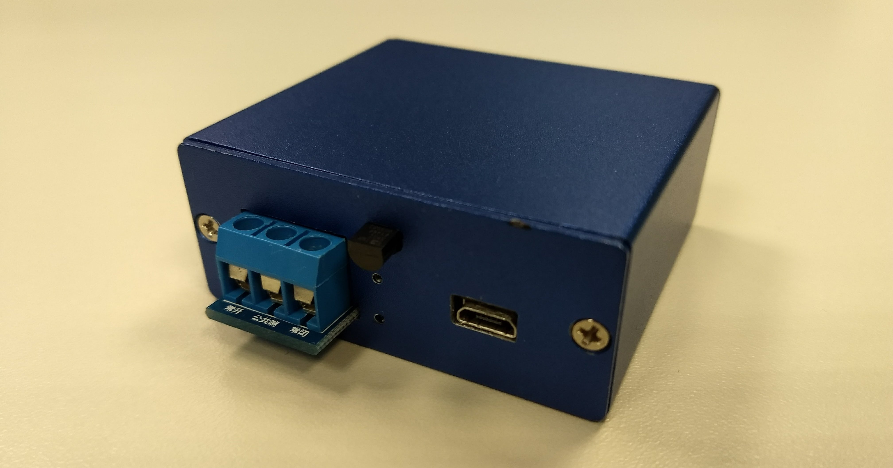

# fC Mark I - Fan Controller

## Introduction

## Changes
All notable changes to this project will be documented in this [Change log](CHANGELOG.md).

## Mechanics
This project uses an original mech made from scratch with the following goals:
- Reliable
- Robust
- Well done
- Cheap, but beautiful

Check out [Mechanics](Mechanics/README.md) design to know more.

## Electronics
Arduino and other [Electronics](Electronics/README.md) are used.

## Firmware
The [Firmware](fC/README.md) is an original creation. :-)

## BOM - Bill of materials
If you want to build your own, take a look at [Bill of materials](BOM.md).

---
