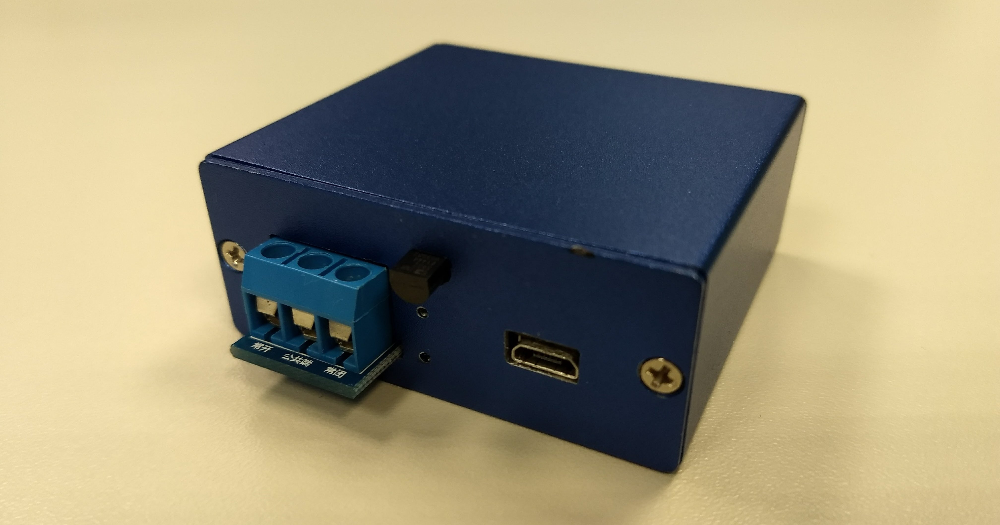
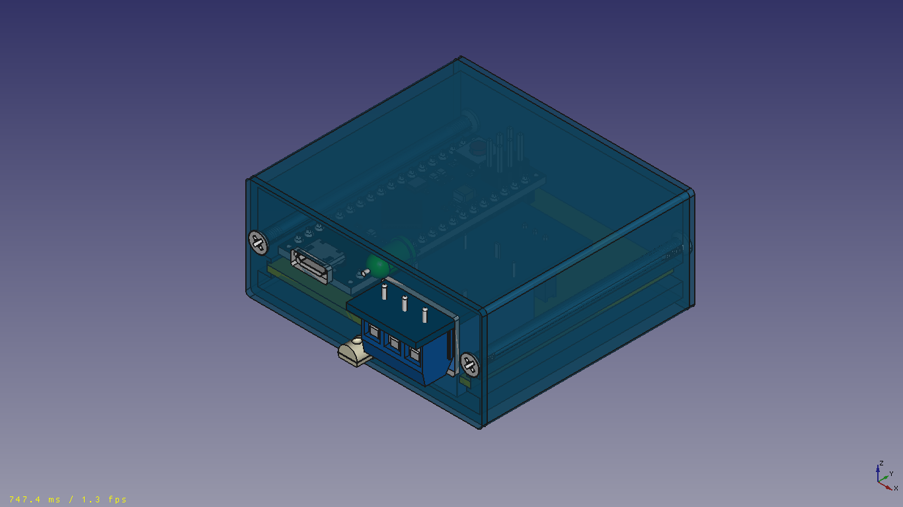
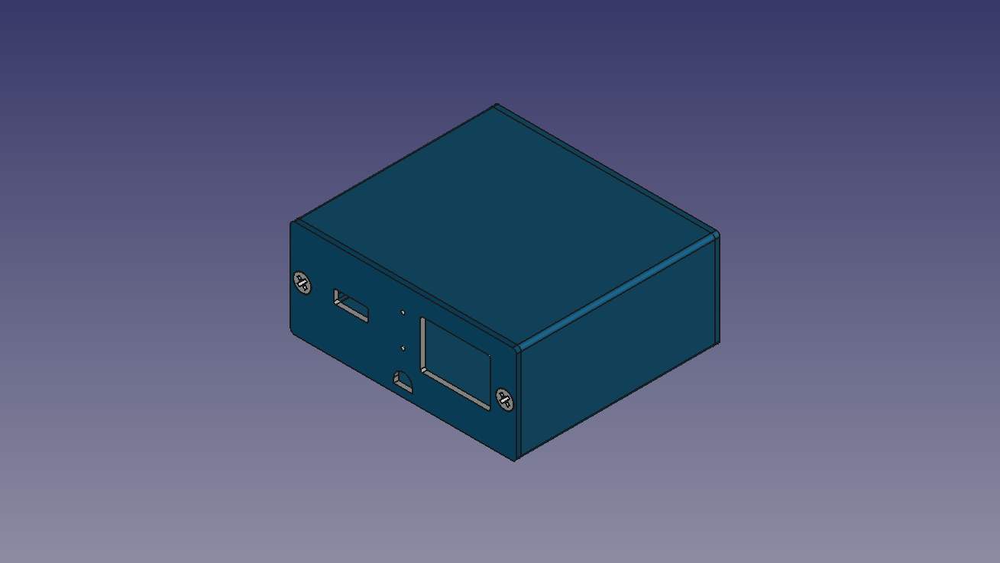
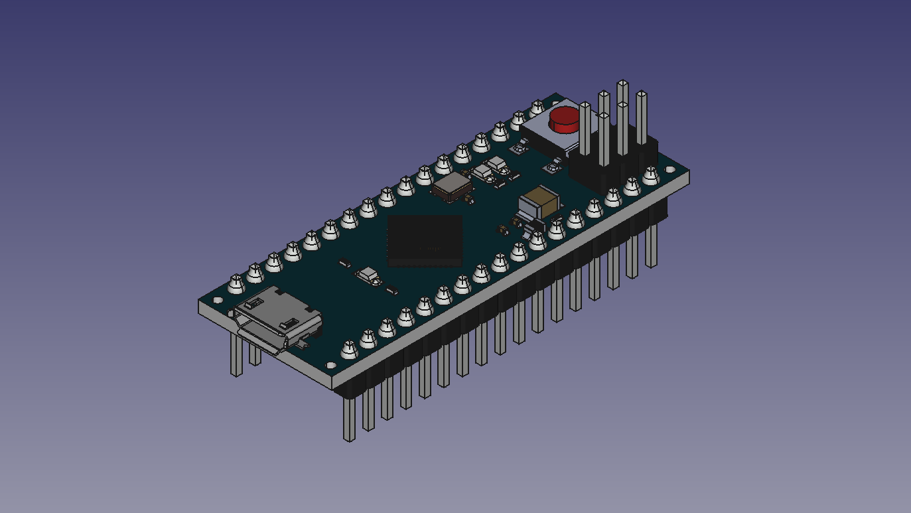
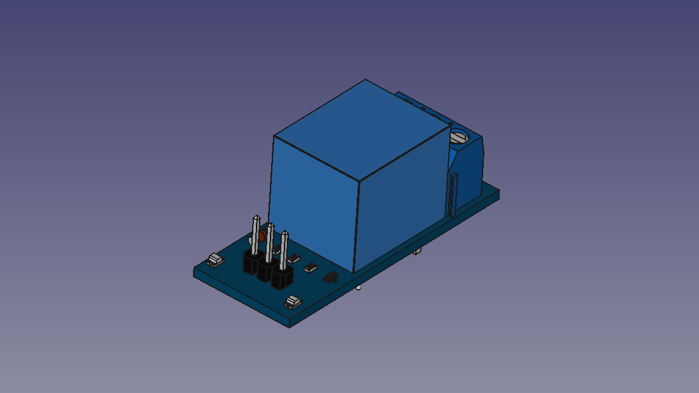

# fC Mark I - Fan Controller

[Change log](CHANGELOG.md)

[Bill of materials](BOM.md)





## Mechanics


## Electronics


### Arduino
Arduino Micro


#### Pin designation table
 id | pin |   type    | direction |               description
----|-----|-----------|-----------|------------------------------------------
  0 |   0 | digital   | input     | Serial communication
  1 |   1 | digital   | output    | Serial communication
  2 |   0 | -         | -         | -
  3 |   3 | digital   | output    | Relay
  4 |   4 | -         | -         | -
  5 |   5 | -         | -         | -
  6 |   6 | -         | -         | -
  7 |   7 | -         | -         | -
  8 |   8 | -         | -         | -
  9 |   9 | PWM       | output    | Alarm LED
 10 |  10 | -         | -         | -
 11 |  11 | -         | -         | -
 12 |  12 | -         | -         | -
 13 |  13 | PWM       | output    | Status LED
 14 |   0 | analog    | input     | Temperature sensor
 15 |   1 | -         | -         | -
 16 |   2 | -         | -         | -
 17 |   3 | -         | -         | -
 18 |   4 | -         | -         | -
 19 |   5 | -         | -         | -


#### Diagram


#### ATmega 32U4-Arduino Pin Mapping


### Relay module


## Software

Use a terminal program at *9600* baud to connect and use G-Code commands.

### M15 - System information

#### Usage

`
M15
`

 Argument    | Description                                                      
-------------|---------------------------------
 none        | -

#### Notes

None.

#### Example

Get system information:

```sh
M15
```

### M71 - Set temperature threshold

#### Usage

`
M71 Wn Cn
`

 Argument    | Description                                                      
-------------|---------------------------------
 W           | Warning temperature threshold
 C           | Critical temperature threshold                                    

#### Notes

Both argumens are necessary.

#### Example

Set warning threshold to 35 *C and critical threshold to 50 *C:

```sh
M71 W35 C50
```

### M82 - Relay status

#### Usage

`
M82
`

 Argument    | Description                                                      
-------------|---------------------------------
 none        | -

#### Notes

None.

#### Example

Get relay status:

```sh
M82
```

### M89 - Memory information

#### Usage

`
M89
`

 Argument    | Description                                                      
-------------|---------------------------------
 none        | -

#### Notes

None.

#### Example

Get memory information:

```sh
M89
```

### M91 - Temperature information

#### Usage

`
M91
`

 Argument    | Description                                                      
-------------|---------------------------------
 none        | -

#### Notes

None.

#### Examples

Get current temperature:

```sh
M91
```

Get current temperature and thresholds:

```sh
M111
M91
```

### M92 - System version

#### Usage

`
M92
`

 Argument    | Description                                                      
-------------|---------------------------------
 none        | -

#### Notes

None.

#### Example

Get firmware version:

```sh
M92
```

### M100 - Help message

#### Usage

`
M100
`

 Argument    | Description                                                      
-------------|---------------------------------
 none        | -

#### Notes

None.

#### Example

Get system information:

```sh
M100
```

### M111 - Debug mode

#### Usage

`
M111
`

 Argument    | Description                                                      
-------------|---------------------------------
 none        | -

#### Notes

None.

#### Example

Enable debug mode:

```sh
M111
```
